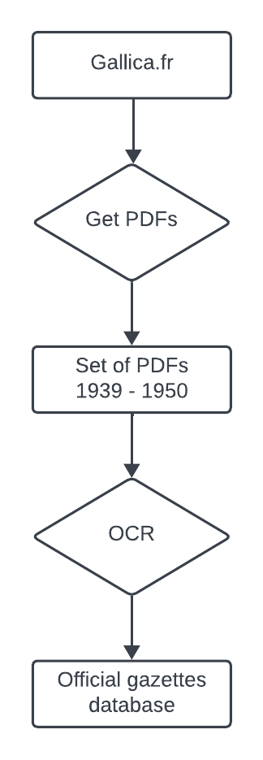

# Genealogy project

This project began when I wanted to find information about my Polish ancestors. I was soon confronted with a lack of information about my paternal great-grandfather's naturalization. All I had was his letter of declaration to claim French citizenship (Figure below). 

This project requires skills in web scraping, optical character recognition and database management.

  

I know that naturalization decrees are published in the Journal Officiel de la République Française (official journals). This project is as follows:

1. Retrieve official journals from the gallica.fr website over a given period of time
2. Apply an optical character recognition (OCR) algorithm to the PDFs.
3. Search the text for an occurrence of my paternal great-grandfather's surname.

  

